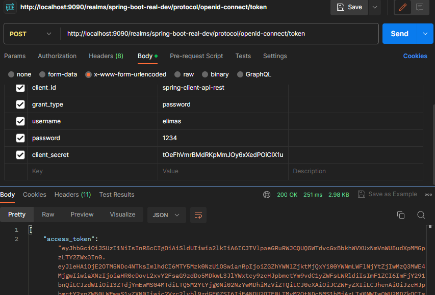
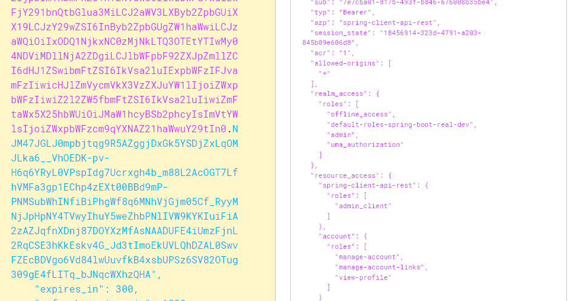
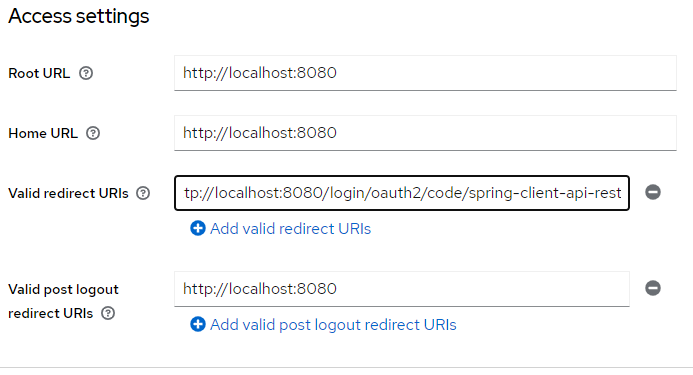

# microservicios

01 Configuracion Inicial.

02 RestTemplate

03 openfeign
   -novedad
	<properties>
		<java.version>20</java.version>
		<spring-cloud.version>2022.0.4</spring-cloud.version>
	</properties>
	
	<dependency>
		<groupId>org.springframework.cloud</groupId>
		<artifactId>spring-cloud-starter-openfeign</artifactId>
	</dependency>

	<dependencyManagement>
		<dependencies>
			<dependency>
				<groupId>org.springframework.cloud</groupId>
				<artifactId>spring-cloud-dependencies</artifactId>
				<version>${spring-cloud.version}</version>
				<type>pom</type>
				<scope>import</scope>
			</dependency>
		</dependencies>
	</dependencyManagement>

04 ejemplo de configuracion con config service
	-Anotacion importante
	config-service 
	config-data

	dependencias
	--
	<dependency>
		<groupId>org.springframework.cloud</groupId>
		<artifactId>spring-cloud-starter-config</artifactId>
	</dependency>
	<!-- https://mvnrepository.com/artifact/org.springframework.cloud/spring-cloud-				           starter-bootstrap -->
	<dependency>
		<groupId>org.springframework.cloud</groupId>
		<artifactId>spring-cloud-starter-bootstrap</artifactId>
	</dependency>

	<properties>
		<java.version>20</java.version>
		<spring-cloud.version>2022.0.4</spring-cloud.version>
	</properties>
	se crean los archivos de configuracion para acada uno de los servicios
	microservicios/bike-service/src/main/resources/bootstrap.yaml

	configuracion del archivo bootstrap.yaml principal del servidor
	server:
         port: 8081
        spring:
         cloud:
           config:
            server:
             git:
             default-label: 04_config_server
             uri: https://github.com/Elimasrojas/microservicios
            search-paths: config-data
        application:
          name: config-service

05 ejemplo de configuracion con eureka
	--orden de ejecucion
		1-conf-service
		2-eureka-service
		3-bike-service
		4-car-service
		5-user-service

06 ejemplo de configuracion con eureka multiples instancias
	--orden de ejecucion 
		1-conf-service
		2-eureka-service
		3-bike-service
		4-car-service
		5-user-service
	al abrir http://localhost:8761/
	vemos que se crean varias instancias como estas
	* bike-service:c673d34f09e5718ff4ef4cc1770a8ec8 
	* bike-service:f5eb595a4b93d98cdb87fc555802dc13

	aca tenemos un problema al estar configurando la puerta de enlace
	por eseo se recomienda el gateway
07- configurando gateway 
	***
proporcionar un enrutamiento y equilibrio de carga eficiente para aplicaciones basadas en microservicios. Spring Cloud Gateway actúa como un punto de entrada para el tráfico externo y puede realizar diversas funciones, como enrutamiento dinámico, filtrado, balanceo de carga, seguridad y más.

Algunas características clave de Spring Cloud Gateway son:

Enrutamiento Dinámico: Permite definir reglas de enrutamiento que determinan cómo se dirige el tráfico entrante a los diferentes microservicios basándose en una variedad de criterios, como la URL, las cabeceras HTTP, parámetros de consulta, etc.

Filtrado: Puede aplicar filtros en el flujo de solicitud y respuesta. Estos filtros pueden ser utilizados para realizar tareas como autenticación, autorización, logging, compresión, modificación de cabeceras, etc.

Balanceo de Carga: Puede distribuir el tráfico entre instancias de un microservicio para mejorar la disponibilidad y el rendimiento.

Gestión de Errores: Proporciona manejo de errores más elegante y personalizado que los enfoques tradicionales. Puede redirigir a los usuarios a páginas de error personalizadas o tomar otras acciones basadas en el tipo de error.

Integración con Spring Ecosystem: Spring Cloud Gateway se integra sin problemas con otras partes del ecosistema Spring, lo que facilita la configuración y personalización.

Carga Dinámica de Rutas: Puede actualizar las reglas de enrutamiento en tiempo de ejecución sin necesidad de reiniciar la aplicación.

****orede de ejecucion
********config-service
********eureka
********gateway
********bike
********car
********user

08_load-balancer

# este es el gateway.yaml
server:
port: 8080

eureka:
client:
fetch-registry: true
register-with-eureka: true
service-url:
default-zone: http://localhost:8761/eureka
instance:
hostname: localhost

spring:
cloud:
gateway:
discovery:
locator:
enable: true
routes:
- id: user-service
uri: lb://user-service
predicates:
- Path=/user/**
- id: car-service
uri: lb://car-service
- # nnotamos que se esta pasando el balanceador de carga
- # con el nombre se saca del configdata y la ruta Path=/user/** esta se saca del controlador
predicates:
- Path=/car/**
- id: bike-service
uri: lb://bike-service
predicates:
- Path=/bike/**

Este es el user-service.yaml
server:
port: ${PORT:${SERVER_PORT:0}}
# el port es  igual a 0 para que lo cree aleatoriamente en una lista de puertos disponibles
eureka:
client:
fetch-registry: true
register-with-eureka: true
service-url:
default-zone: http://localhost:8761/eureka
instance:
instance-id: ${spring.application.name}:${spring.application.instance_id:${random.value}}

por ejemplo
### * cada proyecto en la carga busca el cloud config en su archivo yaml
### * iniciamos arrancando el Config-service
### * despues arranacamo es eureka service (para tenerlos todos en un lista)
### * espues dos instancias de bike-service
### * por ultimo la puerta de enlace gateway-service

# 09_circuit braker

*** es un patron que evita que el sistema falle auque se deje  de operar un componente ***

<!-- https://mvnrepository.com/artifact/org.springframework.boot/spring-boot-starter-aop -->
<dependency>
    <groupId>org.springframework.boot</groupId>
    <artifactId>spring-boot-starter-aop</artifactId>
    <version>3.1.3</version>
</dependency>
<dependency>
      <groupId>org.springframework.boot</groupId>
      <artifactId>spring-boot-starter-actuator</artifactId>
</dependency>
<dependency>
      <groupId>org.springframework.cloud</groupId>
      <artifactId>spring-cloud-starter-circuitbreaker-resilience4j</artifactId>
</dependency>

ordes de prueba
1 config service
2 eureka
3 user
4 gateway

pruebas
localhost:8080/user
localhost:8080/user/cars/1
localhost:8080/user/bikes/1

# 10_zipkin_y_sleuth

* Herramienta de rastreo de microservicios *
*
Hasta mi última actualización en septiembre de 2021, Spring Cloud Sleuth y Zipkin son bibliotecas que se utilizan para el rastreo y la monitorización de solicitudes en microservicios. Spring Cloud Sleuth se encarga de generar y propagar identificadores únicos en las solicitudes a través de los diferentes componentes de una aplicación, mientras que Zipkin es una herramienta de trazabilidad distribuida que ayuda a recopilar y visualizar información sobre el tiempo y las dependencias de las solicitudes.

osea se configuro con acuator y micrometer y zipkin
estas dependencias van en bike-car y user-service y car-service

<!-- tracyng -->
		<dependency>
			<groupId>org.springframework.boot</groupId>
			<artifactId>spring-boot-starter-actuator</artifactId>
		</dependency>
		<dependency>
			<groupId>io.micrometer</groupId>
			<artifactId>micrometer-tracing</artifactId>
			<version>1.1.0</version>
		</dependency>
		<dependency>
			<groupId>io.opentelemetry</groupId>
			<artifactId>opentelemetry-exporter-zipkin</artifactId>
		</dependency>
		<dependency>
			<groupId>io.micrometer</groupId>
			<artifactId>micrometer-tracing-bridge-otel</artifactId>
		</dependency>
		<dependency>
			<groupId>io.micrometer</groupId>
			<artifactId>micrometer-registry-prometheus</artifactId>
		</dependency>

**
descargar de https://zipkin.io/pages/quickstart.html

Java
If you have Java 8 or higher installed, the quickest way to get started is to 
fetch the latest release as a self-contained executable jar:

curl -sSL https://zipkin.io/quickstart.sh | bash -s
java -jar zipkin.jar
**
entonces el oren de ejecucion es 
1.zipkin con java -jar zipkin***.jar
2.conf-service
3.eureka
4.5.6 bike -car-user -service
7 gateway-servive :)

# 11_keycloak_part1

## Esta es la parte mas enrredada el la aitenticacion con OAUTH2 y se realizara con keycloack

- se tendra un cliente en el gateway
- al Usuario que es el el endpoind donde nos conectamos ppalmente desde el  
-  gateway se tendra un resourceserve

1 - descargamos el server de keycloacks https://www.keycloak.org/downloads
2 - vconfigurar el .gitignore
3 - https://wildfly-security.github.io/wildfly-elytron/blog/securing-wildfly-apps-openid-connect/#securing-an-application-using-oidc
4 - para versiones anteriores
	correr este script
	./bin/standalone.sh -Djboss.socket.binding.port-offset=100
4.5 - requisito tener instalado java 17 o superior
5 - Para versiones actuales
	configurar el puerto en la carpeta conf de keycloac
	http-port=9090 por ejemplo
6 - iniciar keycloak en la carpeta bin
	kc.bat start-dev
	
7 - inicion se sesion en nuestro realm
	http://localhost:9090/realms/[REALM-NAME]/.well-known/openid-configuration/
8 - lo probamos en POSTMAN
	"token_endpoint": "http://localhost:9090/realms/spring-boot-real-dev/protocol/openid-connect/token",

- https://devops.datenkollektiv.de/banner.txt/index.html
-  esta es la confoguracion del cliente Keycloak
  Valid=http://localhost:8080/login/oauth2/code/spring-client-api-rest
  recordemos que http://localhost:8080 es nuestro gateway

